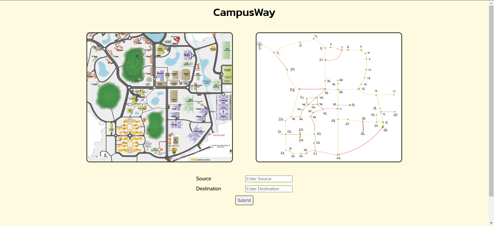
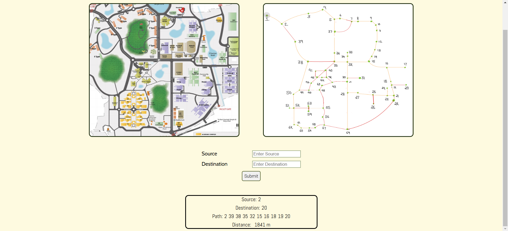

# CampusWay
- It's a basic navigation project that identifies the shortest distance and optimal travel route between two points on the IITG campus map.
  
 

## Installation Guide
### Requirements
- Node.js
- python

```shell
git clone https://github.com/Ishant2004/campusWay.git
cd CampusWay-main
```
install all the react dependencies
```shell
npm install
```
install all the python libraries
```shell
pip install flask
```
### ignore all the vulnerabilities...
run the python backend server
```shell
python server.py
```
run the react front-end
```shell
npm run start
```
 
